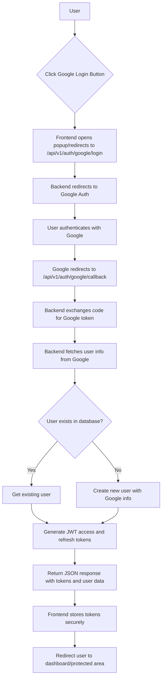

# Google OAuth 2.1 Integration

## Overview

This document describes the integration of Google OAuth 2.1 for user authentication within the application. This feature allows users to sign in using their Google accounts, providing a seamless and secure authentication experience. The process involves initiating an OAuth flow with Google, handling the callback, exchanging authorization codes for tokens, and ultimately generating a JSON Web Token (JWT) for the authenticated user.

## Configuration

To enable Google OAuth 2.1 authentication, the following environment variables must be configured. These variables are loaded into the central `Env` struct in `imphnen-libs`.

*   `GOOGLE_CLIENT_ID`: Your Google OAuth 2.1 Client ID.
*   `GOOGLE_CLIENT_SECRET`: Your Google OAuth 2.1 Client Secret.
*   `GOOGLE_REDIRECT_URL`: The URL to which Google will redirect the user after successful authentication. This must match one of the authorized redirect URIs configured in your Google Cloud Console (e.g., `http://127.0.0.1:8080/api/v1/auth/google/callback`).

### Obtaining Credentials from Google Cloud Console

1.  **Navigate to Google Cloud Console:** Go to the [Google Cloud Console](https://console.cloud.google.com/).
2.  **Select/Create a Project:** Choose an existing project or create a new one.
3.  **Enable Google People API:** In the navigation menu, go to `APIs & Services` > `Library` and search for "Google People API" and enable it.
4.  **Create OAuth Consent Screen:** Go to `APIs & Services` > `OAuth consent screen`.
    *   Configure your consent screen, including application name, user support email, and developer contact information.
5.  **Create Credentials:** Go to `APIs & Services` > `Credentials`.
    *   Click `Create Credentials` > `OAuth client ID`.
    *   Select "Web application" as the application type.
    *   Provide a name for your OAuth 2.0 client.
    *   Under `Authorized redirect URIs`, add the `GOOGLE_REDIRECT_URL` specified in your environment variables (e.g., `http://127.0.0.1:8080/api/v1/auth/google/callback`).
    *   Click "Create". Your Client ID and Client Secret will be displayed. Copy these values and set them as `GOOGLE_CLIENT_ID` and `GOOGLE_CLIENT_SECRET` in your environment.

## API Endpoints

### 1. Initiate Google OAuth Flow

*   **Endpoint:** `/api/v1/auth/google/login`
*   **Method:** `GET`
*   **Description:** This endpoint initiates the Google OAuth 2.1 authentication flow. When accessed, it generates a Google authorization URL and redirects the user's browser to Google's authentication page. The user will be prompted to grant permissions to your application.

*   **Example `curl` command:**

    ```bash
    curl -v http://127.0.0.1:8080/api/v1/auth/google/login
    ```

    Upon successful execution, this command will return a `302 Found` status with a `Location` header containing the Google authorization URL. Your browser would typically follow this redirect.

### 2. Handle Google OAuth Callback

*   **Endpoint:** `/api/v1/auth/google/callback`
*   **Method:** `GET`
*   **Description:** This endpoint handles the redirect from Google after the user has authenticated and granted permissions. Google sends an authorization `code` and a `state` parameter to this URL. The application then uses this `code` to exchange it for an access token and user information with Google. Upon successful validation and user creation/login, a JSON response is returned containing authentication tokens and user details, identical to the credential-based login endpoint.

*   **Query Parameters:**
  * `code` (required): The authorization code provided by Google.
  * `state` (required): The CSRF token generated during the login initiation.

*   **Response:** Returns a JSON object containing authentication tokens and user information.

*   **Example `curl` command (conceptual, as `code` and `state` are dynamic):**

    ```bash
    # This curl command is illustrative. The `code` and `state` values are obtained dynamically
    # from Google's redirect after the user authorizes your application.
    # Replace <AUTHORIZATION_CODE> and <CSRF_STATE> with actual values from the Google redirect.

    curl -v "http://127.0.0.1:8080/api/v1/auth/google/callback?code=<AUTHORIZATION_CODE>&state=<CSRF_STATE>"
    ```

*   **Success Response (200 OK):**

    ```json
    {
      "token": {
        "access_token": "your_access_token_here",
        "refresh_token": "your_refresh_token_here"
      },
      "user": {
        "id": "user_id_here",
        "role": {
          "id": "role_id_here",
          "name": "Role Name",
          "permissions": [],
          "created_at": "2023-01-01T12:00:00Z",
          "updated_at": "2023-01-01T12:00:00Z"
        },
        "fullname": "User Fullname",
        "email": "user@example.com",
        "avatar": "http://example.com/avatar.jpg",
        "phone_number": "1234567890",
        "is_active": true,
        "gender": "Male",
        "birthdate": "2000-01-01T00:00:00Z",
        "created_at": "2023-01-01T12:00:00Z",
        "updated_at": "2023-01-01T12:00:00Z"
      }
    }
    ```

## React Frontend Implementation

This section outlines how to integrate the Google OAuth 2.1 flow into a React application using the JSON API response approach.

### 1. Initiating the Login Flow

Users will click a button or link to initiate the Google OAuth process. You can implement this using either a popup window or a full page redirect approach.

#### Approach 1: Popup Window (Recommended)

```jsx
// Example React Component for Google Login with Popup
import React, { useState } from 'react';

function GoogleLoginButton() {
  const [isLoading, setIsLoading] = useState(false);

  const handleLogin = () => {
    setIsLoading(true);
    
    // Open Google OAuth in popup window
    const popup = window.open(
      'http://127.0.0.1:8080/api/v1/auth/google/login',
      'googleOAuth',
      'width=500,height=600,scrollbars=yes,resizable=yes'
    );

    // Check if popup is closed manually
    const checkClosed = setInterval(() => {
      if (popup.closed) {
        clearInterval(checkClosed);
        setIsLoading(false);
        console.log('OAuth popup was closed without completion');
      }
    }, 1000);

    // Listen for the popup to navigate to the callback URL
    const checkCallback = setInterval(async () => {
      try {
        if (popup.location.href.includes('/api/v1/auth/google/callback')) {
          clearInterval(checkCallback);
          clearInterval(checkClosed);
          
          // Wait a moment for the request to complete, then get the response
          setTimeout(async () => {
            try {
              // The popup now contains the JSON response from the callback
              const response = await fetch(popup.location.href);
              const data = await response.json();
              
              if (response.ok) {
                // Store tokens securely
                localStorage.setItem('accessToken', data.token.access_token);
                localStorage.setItem('refreshToken', data.token.refresh_token);
                localStorage.setItem('user', JSON.stringify(data.user));
                
                popup.close();
                setIsLoading(false);
                
                // Redirect to dashboard or update app state
                window.location.href = '/dashboard';
              } else {
                throw new Error('Authentication failed');
              }
            } catch (error) {
              console.error('OAuth callback error:', error);
              popup.close();
              setIsLoading(false);
              alert('Google login failed. Please try again.');
            }
          }, 1000);
        }
      } catch (error) {
        // Cross-origin error is expected until callback URL is reached
      }
    }, 1000);
  };

  return (
    <button onClick={handleLogin} disabled={isLoading}>
      {isLoading ? 'Logging in...' : 'Login with Google'}
    </button>
  );
}

export default GoogleLoginButton;
```

#### Approach 2: Full Page Redirect

```jsx
// Example React Component for Google Login with Full Redirect
import React from 'react';

function GoogleLoginButton() {
  const handleLogin = () => {
    // Store current location to redirect back after auth
    localStorage.setItem('preAuthLocation', window.location.pathname);
    
    // Redirect to backend's Google OAuth login endpoint
    window.location.href = 'http://127.0.0.1:8080/api/v1/auth/google/login';
  };

  return (
    <button onClick={handleLogin}>
      Login with Google
    </button>
  );
}

export default GoogleLoginButton;
```

### 2. Handling the OAuth Callback (For Full Redirect Approach)

If using the full page redirect approach, you'll need a callback component to handle the OAuth response.

```jsx
// Example React Component for Google OAuth Callback Handler
import React, { useEffect, useState } from 'react';
import { useLocation, useNavigate } from 'react-router-dom';

function GoogleAuthCallback() {
  const location = useLocation();
  const navigate = useNavigate();
  const [isProcessing, setIsProcessing] = useState(true);
  const [error, setError] = useState(null);

  useEffect(() => {
    const handleCallback = async () => {
      try {
        // Extract query parameters from current URL
        const params = new URLSearchParams(location.search);
        const code = params.get('code');
        const state = params.get('state');

        if (!code || !state) {
          throw new Error('Missing required OAuth parameters');
        }

        // Make request to your backend callback endpoint
        const response = await fetch(
          `http://127.0.0.1:8080/api/v1/auth/google/callback${location.search}`,
          {
            method: 'GET',
            headers: {
              'Content-Type': 'application/json',
            },
          }
        );

        if (!response.ok) {
          throw new Error(`HTTP error! status: ${response.status}`);
        }

        const data = await response.json();

        // Store authentication data
        localStorage.setItem('accessToken', data.token.access_token);
        localStorage.setItem('refreshToken', data.token.refresh_token);
        localStorage.setItem('user', JSON.stringify(data.user));

        // Redirect to intended location or dashboard
        const preAuthLocation = localStorage.getItem('preAuthLocation') || '/dashboard';
        localStorage.removeItem('preAuthLocation');
        
        navigate(preAuthLocation, { replace: true });

      } catch (error) {
        console.error('Google OAuth callback error:', error);
        setError(error.message);
        setIsProcessing(false);
      }
    };

    handleCallback();
  }, [location, navigate]);

  if (error) {
    return (
      <div>
        <h2>Authentication Failed</h2>
        <p>Error: {error}</p>
        <button onClick={() => navigate('/login')}>
          Back to Login
        </button>
      </div>
    );
  }

  return (
    <div>
      <h2>Processing Google Login...</h2>
      <p>Please wait while we complete your authentication...</p>
    </div>
  );
}

export default GoogleAuthCallback;
```

### 3. Example React Router Setup

Ensure your React application's routing is set up to handle the callback URL (only needed if using the full redirect approach).

```jsx
// Example App.js or main router file
import React from 'react';
import { BrowserRouter as Router, Routes, Route } from 'react-router-dom';
import GoogleLoginButton from './components/GoogleLoginButton';
import GoogleAuthCallback from './components/GoogleAuthCallback';
import Dashboard from './components/Dashboard';
import LoginPage from './components/LoginPage';

function App() {
  return (
    <Router>
      <Routes>
        <Route path="/login" element={<LoginPage />} />
        <Route path="/auth/google/callback" element={<GoogleAuthCallback />} />
        <Route path="/dashboard" element={<Dashboard />} />
        {/* Other routes */}
      </Routes>
    </Router>
  );
}

export default App;
```

### 4. Using the Authentication Tokens

Once you have the tokens, you can use them to make authenticated requests to your API:

```jsx
// Example of making authenticated API requests
const makeAuthenticatedRequest = async (url, options = {}) => {
  const accessToken = localStorage.getItem('accessToken');
  
  const response = await fetch(url, {
    ...options,
    headers: {
      ...options.headers,
      'Authorization': `Bearer ${accessToken}`,
      'Content-Type': 'application/json',
    },
  });

  if (response.status === 401) {
    // Token might be expired, try to refresh or redirect to login
    localStorage.removeItem('accessToken');
    localStorage.removeItem('refreshToken');
    localStorage.removeItem('user');
    window.location.href = '/login';
    return;
  }

  return response;
};
```

## OAuth Flow Diagram



## Security Considerations

1. **Token Storage**: Store tokens securely in httpOnly cookies or secure storage mechanisms rather than localStorage in production.

2. **HTTPS Only**: Always use HTTPS in production to protect tokens in transit.

3. **Token Expiration**: Implement proper token refresh logic when access tokens expire.

4. **CORS Configuration**: Ensure your backend has proper CORS configuration for the frontend domain.

5. **State Validation**: The backend validates the CSRF state parameter to prevent CSRF attacks.

6. **Scope Limitation**: Only request necessary OAuth scopes from Google (email and profile in this case).
